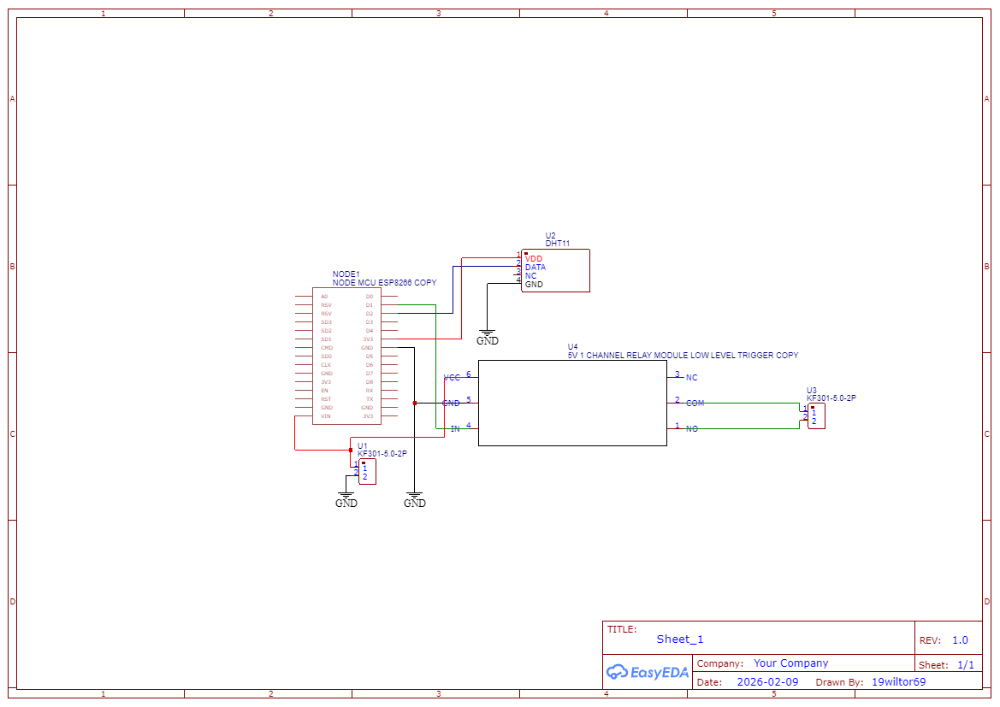
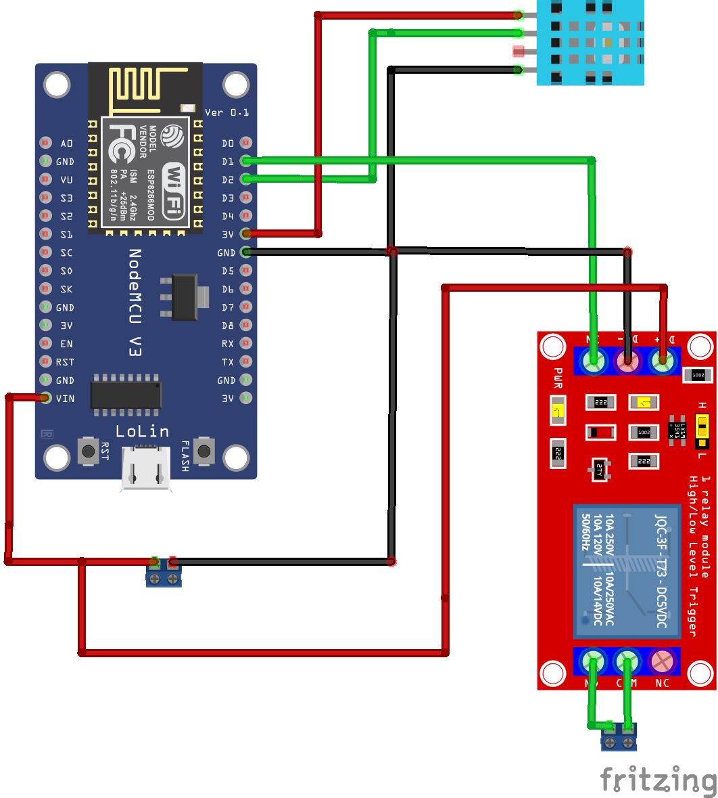

# ESP8266 Wi-Fi temperature controller

Intelligent climate control system with Wi-Fi control, MQTT protocol integration, and dynamic temperature history graphs.

## Features

Standalone thermostat: Maintains the set temperature with a hysteresis of 0.3°C.

Wi-Fi manager: Network configuration without reflashing via the AutoConnectAP access point.

Web interface: Control the target temperature and view graphs via any browser.

MQTT Integration: Real-time data transfer to a broker (EMQX/HiveMQ).

Non-volatile memory: Saving settings and temperature history to the internal LittleFS file system.

Flash protection: Optimized write algorithm (once every 10 minutes) to extend memory life.

Translated with DeepL.com (free version)

## Connection diagram

### 1. Low-voltage part (Logic)

Component            Pin on part         Pin on NodeMCU            Note
Power supply          +5V / GND             VIN / GND            Minimum 1A
DHT11 sensor       VDD / DATA / GND	      3V3 / D2 / GND        Power supply strictly 3.3V
Relay (Module)      VCC / IN / GND	      VIN / D1 / GND       5V power supply for coil

### 2. Power section (AC 220V)

COM (Common): 220V phase input.

NO (Normally Open): Output to the heater.

⚠️ CAUTION: Do not connect a load exceeding 1.5 kW (7A) to ensure the fire safety of the board tracks.

## 🛠 Software configuration

### Required libraries:

DHT sensor library (Adafruit)

PubSubClient (Nick O'Leary)

WiFiManager (tablatronix)

LittleFS (built into the core ESP8266)

## MQTT settings:

Broker: broker.emqx.io (port 1883)

Topic: home/temperature

WebSockets (for graphs): wss://broker.emqx.io:8084/mqtt

## 🚀 Operating instructions:

First launch: Connect to the AutoConnectAP Wi-Fi network from your smartphone. In the window that appears, select your home network and enter the password.

Control: Find out the IP address of the device (via the port monitor or router settings) and enter it in your browser.

Graphs: The page will automatically pull up the history from the device's memory and start updating data in real time via MQTT.

Reset: To change the Wi-Fi network or clear the memory, press the “Reset WiFi” button at the bottom of the page.

